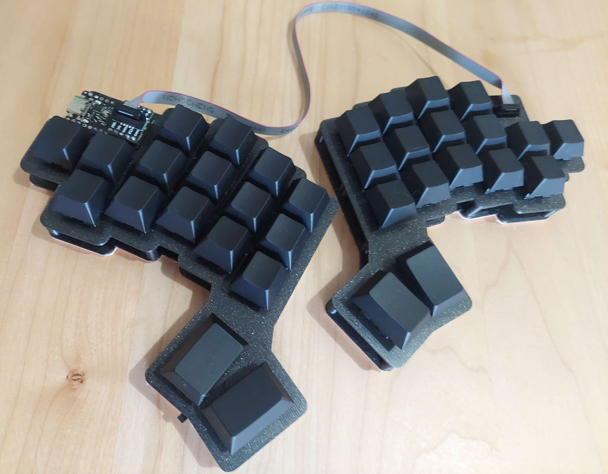
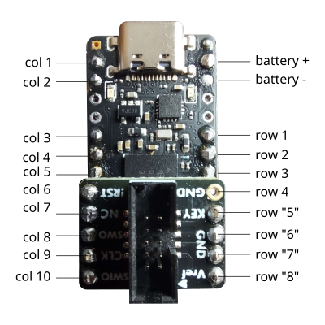

# goshawk

wireless keyboard with distintive features rarely seen elsewhere

* split design, but only requires 1 controller/battery
* 8 physical rows mapped to 4 logical rows makes it easier to wire

splay and key layout inspired by [osprette](https://github.com/smores56/osprette) / [clog](https://github.com/smores56/clog-v2) and [lil chonky bois](https://github.com/sanderboer/chonkybois)

split inspired by [schrodinger](https://www.reddit.com/r/MechanicalKeyboards/comments/yrse5t/the_schrodinger_a_keyboard_thats_both_wired_and/)

## bom

| Syntax          | Quantity    | Link                                              |
| -----------     | ----------- | ----                                              |
| nice-nano       | 1           | https://nicekeyboards.com/nice-nano/#find-a-store |
| battery         | 1           | 601230                                            |
| idc cable board | 2           | https://www.adafruit.com/product/2743             |
| idc cable       | 1           | https://www.adafruit.com/product/5804             |
| power switch    | 1           | https://www.amazon.com/dp/B09R3ZWBBC              |

## build

see [build.md](./build.md)

## pinout

8 physical rows mapped to 4 logical rows. Rows 1-4 are left side, rows 5-8 are right side.

## zmk config

https://github.com/taylorzr/zmk-config/tree/master/config/boards/shields/goshawk
