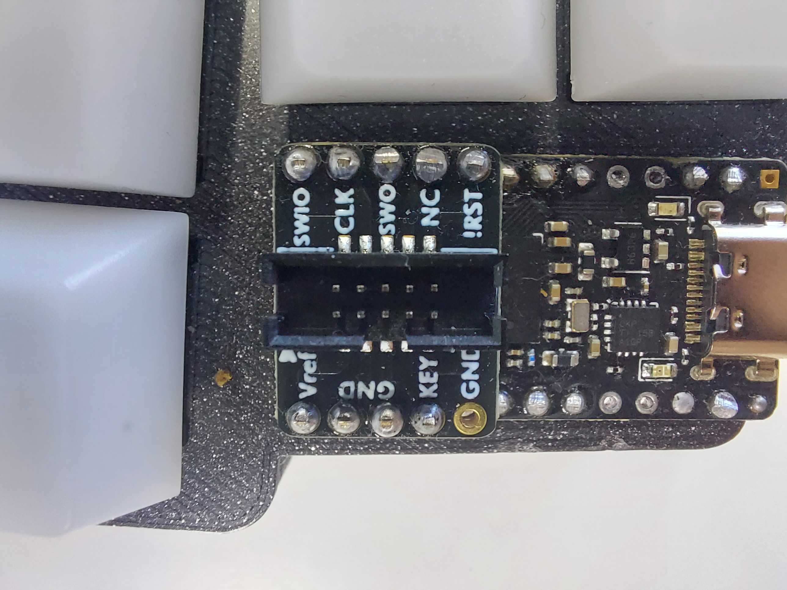

# goshawk build guide

## Wiring left half

### icd board -> microcontroller

Solder headers onto the idc board. And then solder idc board to bottom of the microcontroller.

The important part is the bottom left of the idc board should be left open. The pin is labeled GND on
the idc board. And on the microcontroller, this will be D18.

### microcontroller wiring

Solder wires to the microcontroller. Make sure you leave them long enough to reach the rows,
columns, and power switch.

### microcontroller and battery installation

Pass microcontroller wiring through the case. Insert the battery, and solder the batteries black cable to microcontroller GND.

To attach the microcontroller to the case. I just use a command hook sticker. Cut it to size and slide it into place using a tweezer. Line up everything and squish.

### wire routing

Can run this however you want, but I've found you can get very clean wiring if you route the wires before soldering the matrix. This is a photo of the right side, but same process, route wires for columns, and for row 4.

### solder matrix

Solder colums first, then rows with diodes.

Batteries red cable, and the top right red cable get soldered to the power switch.

## Wiring right half

### Wire idc board

Solder wires to idc board. Same as left half, make sure the wires are long enough to reach
everything.

### Repeat process from the left side

1. route wires
2. solder matrix

## Optional

### hotswap sockets

This is optional but makes hotswap useful, and handwiring easier as it holds the diodes in place.

1. insert switches
2. insert hotswap sockets into holders
3. run a bead of superglue on the hotswap holder
4. press onto switch

